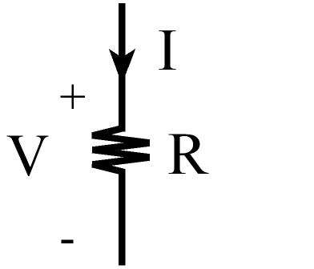
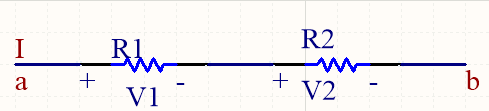
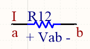
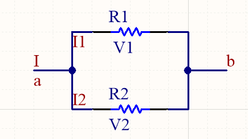
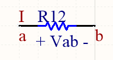
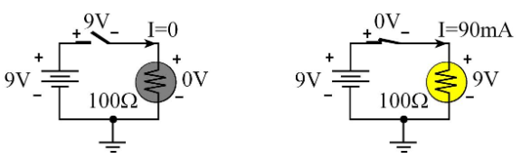
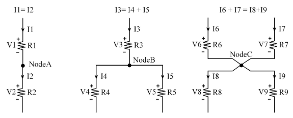

# **Chapter 3 - Electronics**

## **Introduction**

### Ohm's Law 
**Current** (I) 
* Movement of electrons
* Electrons are negative charged
* 1 Ampere = 6.241x1018 Coulomb per second
* Current is flowing to the right

**Voltaje** (V)
* Representing the potential difference between two points
* Two types of conducting media: wire and resistor
* Voltage is the electromotive force or potencial to produce current

> V = C * R

> I = V / R

> R = V / I

### Circuit Basics Lecture
**Charge** 
* Measured in Coulombs
* Charge measured at a point or on an object and does not have a direction

**Current**
* Mmeasured in amps (A)
* Amps is the same as coulombs/sec
* Current represents a flow of charge and hence has a direction

**Energy**
* Measured in Joules (J)
* Other equivalent units of energy are newton-meter, watt-sec, V-A-sec, or kg-m2/s2
* Energy is defined inside an object and does not have a direction

**Power**
* Rate of doing work
* Amount of energy consumed per unit time
* Power is defined at an object and does not have a direction
* The units of power are the joules per second (J/s), or watt, V-A, or kg-m2/s3

**Voltage**
* Measured in volts (V)
* Other equivalent units of voltage are W/A, J/C, or kg-m2/A-s3
* Voltage is defined as the potential difference between two points

### Power and Energy
**Power** (P) - Has neither a polarity nor a direction.

Power = Voltage  * Current:
> P = V * I         

Power = Voltage 2 / Resistance:    
> P = V2 / R             

Power = Current 2 * Resistance:
>P = I2 * R      

**Energy** (E in joules) - Has neither a polarity nor a direction

Energy = Voltage  * Current  * time:
> E = V * I * t

Energy = Power  * time:
> E = P * t

## **Electronic Cirucuits**

### Voltage and Current Division

#### Series resistance

> V1 = (R1 / R1 + R2) * Vab

> V2 = (R2 / R1 + R2) * Vab

> R12 = R1 + R2

> Vab = V1 + V2

#### Parallel resistance

> I1 = (R1 / R1 + R2) * I

> I2 = (R1 / R1 + R2) * I

> Vab = V1 =  V2 

> I = I1 +  I2 

### Circuits with Switches
**Switch** 
* Element used to modify the behavior of the circuit
* If the switch is pressed, its resistance is 0, and current can flow across the switch
* If the switch is not pressed, its resistance is infinite, and no current will flow

### Kirchhoff's Laws
Current always flows in a loop - when the switch is pressed, current flows out of the + side of battery, across the switch, through the light and back to the – side of the battery. 

Kirchhoff's **Voltage Law** (**KVL**) 
* The sum of the voltages around the loop is zero
* The important step is the direction of the current arrow must match the polarity of the corresponding voltage
* As we are going around a circle and pass from + to –, we add that voltage
* If we pass across an element from – to + we subtract that voltage

Kirchhoff's **Current Law** (**KCL**)
* The sum of the currents into a node equal the sum of the currents leaving a node
* Current arrow across a resistor goes from the + voltage to the – voltage
* This is the same thing as saying current comes out of the battery’s + terminal and into the battery’s – terminal

