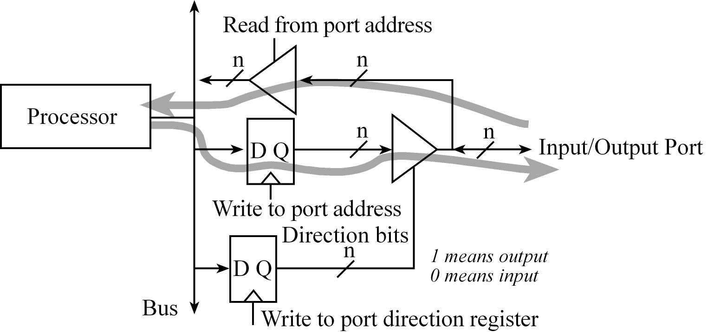
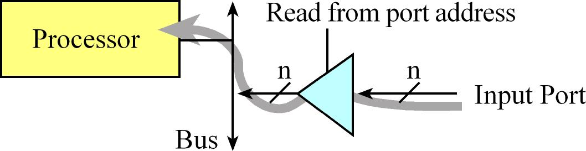
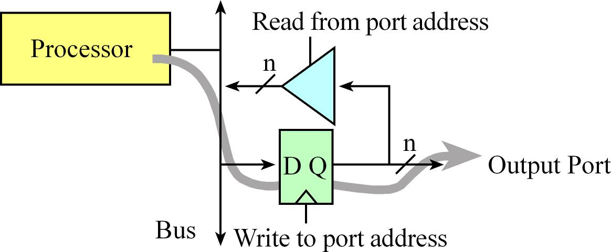
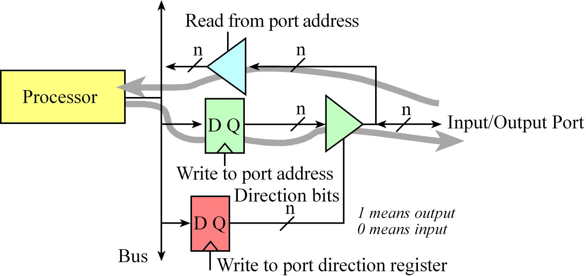

# Chapter 6 - Microcontroller Ports

## Introduction
### Overview of I/O ports
Exchange digital information with the external world is possible with parallel ports or GPIO. From the very beginning of a project, we must consider how the system will be tested.

The regular function of a pin is to perform parallel I/O. Most pins, however, have an alternative function. For example, some ports can be either regular parallel port pins or an asynchronous serial port called universal asynchronous receiver/transmitter (**UART**). 
Joint Test Action Group (**JTAG**), standardized as the IEEE 1149.1, is a standard test access port used to program and debug the microcontroller board. Each microcontroller uses five port pins for the JTAG interface.

I/O pins on microcontrollers have a wide range of alternative functions:
* **UART** (Universal asynchronous receiver/transmitter)
It can be used for serial communication between computers. It is asynchronous and allows for simultaneous communication in both directions. 

* **SSI** (Synchronous serial interface)
It is alternately called serial peripheral interface (**SPI**). It is used to interface medium-speed I/O devices. We could use SSI to interface a digital to analog converter (DAC) or a secure digital card (SDC).

* **I<sup>2</sup>C** (Inter-integrated circuit)
Simple I/O bus that we will use to interface low speed peripheral devices. Input capture and output compare will be used to create periodic interrupts and measure period, pulse width, phase, and frequency.

* **Timer** - Periodic interrupts, input capture, and output compare

* **PWM** - (Pulse width modulation)
Its outputs will be used to apply variable power to motor interfaces. In a typical motor controller, input capture measures rotational speed, and PWM controls power. A PWM output can also be used to create a DAC.

* **ADC** - Analog to digital converter
will be used to measure the amplitude of analog signals and will be important in data acquisition systems. 

* **Analog Comparator** - Compare two analog signals
Takes two analog inputs and produces a digital output depending on which analog input is greater.

* **QEI** - Quadrature encoder interface
Can be used to interface a brushless DC motor.

* **USB** - Universal serial bus
This is a high-speed serial communication channel. 

* **Ethernet** - High-speed network
Can be used to bridge the microcontroller to the Internet or a local area network.

* **CAN** - Controller area network
It creates a high-speed communication channel between microcontrollers and is commonly found in automotive and other distributed control applications.

* **Mixed-signal** refers to a system with both analog and digital components. Notice how many I/O ports perform this analog-digital bridge: ADC, DAC, analog comparator, PWM, QEI, Input capture, and output compare.

## Tiva TM4C123 LaunchPad I/O Pins 
### TM4C123 Block Diagram
There are two buses used for I/O. The digital I/O ports are connected to both the advanced peripheral bus and the advanced high-performance bus. 
Because of the multiple buses, the microcontroller can perform I/O bus cycles simultaneous with instruction fetches from flash ROM.

### Overview of Ports Lecture
An **input port** has the direction register bit at 0, meaning the software can only read the values on the **input pin**. An **output port** has the direction register bit at 1, meaning the software can read and write to the pin.



### LaunchPad Pins
Each pin has one configuration bit in the **GPIOAMSEL** register. Set this bit to connect the port pin to the ADC or analog comparator. 
Each pin also has four bits in the **GPIOPCTL** register, which is set to specify the alternative function for that pin (0 means regular I/O port). 

### LaunchPad External Hardware
Pins PA1 – PA0 create a serial port, which is linked through the debugger cable to the PC. The USB device interface uses PD4 and PD5.

The evaluation board has two switches and one 3-color LED. The switches are negative logic and will require activation of the internal pull-up resistors.
In particular, you will set bits 0 and 4 in ```GPIO_PORTF_PUR_R``` register. The LED interfaces on **PF3** – **PF1** are positive logic. To use the LED, make the **PF3** – **PF1** pins an output. 
To activate the **red** color, output a one to **PF1**. The **blue** color is on **PF2**, and the **green** color is controlled by **PF3**.

## Basic Concepts of Input and Output Ports
### Digital Circuits of an Input and Output Port
A parallel I/O port is a simple mechanism that allows the software to interact with external devices. It is called parallel because multiple signals can be accessed all at once. 

An **input port** - Allows the software to read external digital signals, is read only. That means a read cycle access from the port address returns the values existing on the inputs at that time.
In particular, the tristate driver will drive the input signals onto the data bus during a read cycle from the port address. A write cycle access to an input port usually produces no effect. The digital values existing on the input pins are copied into the microcontroller when the software executes a read from the port address.



**Readable output port** - A write cycle to the port address will affect the values on the output pins. In particular, the microcontroller places information on the data bus and that information is clocked into the D flip-flops.



### Digital Circuit of a Bidirectional I/O Pin
Microcontrollers use the concept of a direction register to determine whether a pin is an input (direction register bit is 0) or an output (direction register bit is 1).
**Initialization ritual** is a program executed during start up that initializes hardware and software. If the ritual software makes direction bit zero, the port behaves like a simple input, and if it makes the direction bit one, it becomes a readable output port.
Each digital port pin has a direction bit. This means some pins on a port may be inputs while others are outputs. The digital port pins on most microcontrollers are bidirectional.



## I/O Programming and the Direction Register
### GPIO Registers
Direction register ```GPIO_PORTF_DIR_R``` specifies which pins are input and which are output. Individual port pins can be general purpose I/O (GPIO) or have an alternate function.
We will set bits in the alternate function register ```GPIO_PORTF_AFSEL_R``` when we wish to activate the alternate functions. For each I/O pin we wish to use whether GPIO or alternate function we must enable the digital circuits by setting the bit in the enable register ```GPIO_PORTF_DEN_R```. 
We use the data register ```GPIO_PORTF_DATA_R``` to perform input/output on the port. Conversely, we read and write the data register multiple times to perform input and output respectively during the running phase.

### Software to initialize Port F
To initialize an I/O port for general use, we perform eight steps.
1. Activate the clock for the port. ```SYSCTL_RCGC2_R```
2. Unlock the port; unlocking is needed only for pins PC3-0, PD7, PF0 on the LM4F and TM4C. ```GPIO_PORTF_LOCK_R = 0x4C4F434B``` 
3. Allow changes to unlock pins. ```GPIO_PORTF_CR_R```
4. Disable the analog function of the pin, because we will be using the pin for digital I/O. ```GPIO_PORTF_AMSEL_R```
5. Clear bits in the PCTL to select regular digital function. ```GPIO_PORTF_PCTL_R```
6. Set its direction register. Specify whether the pin is an input or an output by clearing or setting bits in the DIR register. ```GPIO_PORTF_DIR_R``` 
7. Clear bits in the alternate function register. ```GPIO_PORTF_AFSEL_R```
8. Enable the digital port. ```GPIO_PORTF_DEN_R```


It is necessary to add a short delay between activating the clock and accessing the port registers. The direction register specifies bit for bit whether the corresponding pins are input or output.

### Writing friendly code
Only affect the bits in which we are interested and leave the remaining bits unchanged. Writely friendly code makes it easier to combine code written at different times for different purposes.

The typical manner in which we change just some bits is:
1. Read the value in the I/O register into a variable
2. Mask or clear bits we wish to change to zero in the variable
3. Select or set bits we wish to change to one in the variable
4. Write the variable back to the I/O register

Example
```c
in = GPIO_PORTB_DATA_R; // read value
in &= ~0x08;            // clear bit 3
in |= 0x20;             // set bit 5
GPIO_PORTB_DATA_R = in; // update port
```

There are two ways on TM4C microcontrollers to access individual port bits. 
* A read-modify-write software to change just one pin. 
```c
  LDR R1, = GPIO_PORTA_DATA_R
  LDR R0, [R1]      ; previous
  ORR R0, R0, #0x80 ; set bit 1
  STR R0, [R1]
```
```c
// make PA7 high
GPIO_PORTA_DATA_R |= 0x80;
```
* A read-or-write sequence can be used to set bits.
```c
  LDR R1, =GPIO_PORTA_DATA_R
  LDR R0, [R1]      ; previous
  BIC R0, R0, #0x80 ; clear bit 1
  STR R0, [R1]
```
```
// make PA7 low
GPIO_PORTA_DATA_R &= ~0x80;
```

### Bit specific addressing
Bit-specific addressing allows you to read/write access 1 or more bits of a data port without affecting the other bits of the port. This bit-specific addressing doesn’t work for all the I/O registers, just the parallel port data registers. 
Basically, if we are interested in bit b, the constant is 4*<sup>2</sup>. There are 256 possible bit combinations we might be interested in accessing, from all of them to none of them. Each possible bit combination has a separate address for accessing that combination. For each bit we are interested in, we add up the corresponding constants and then add that sum to the **base address** for the port. 

| Base address  | Base address  | Address offsets  | Constant  |
| ------------- |:-------------:| -----------------| :--------:|
| Port A        | 0x40004000    | Bit 7            | 0x200     |
| Port B        | 0x40005000    | Bit 6            | 0x100     |
| Port C        | 0x40006000    | Bit 5            | 0x080     |
| Port D        | 0x40007000    | Bit 4            | 0x040     |
| Port E        | 0x40024000    | Bit 3            | 0x020     |
| Port F        | 0x40025000    | Bit 2            | 0x010     |
|               |               | Bit 1            | 0x008     |
|               |               | Bit 0            | 0x004     |

For each bit we are interested in, we add up the corresponding **constants** and then add that sum to the **base address** for the port. 

For example, the base address for Port A is 0x4000.4000. If we want to read and write to all 8 bits of this port, the sum of the base address and the constants yields the 0x4000.43FC address. 
In other words, read and write operations to GPIO_PORTA_DATA_R will access all 8 bits of Port A. If we are interested in just one bit of Port A, we add the offset from Table 6.3 to 0x4000.4000, and we can define these in C.

```C
#define PA7   (*((volatile unsigned long *)0x40004200))
#define PA6   (*((volatile unsigned long *)0x40004100))
#define PA5   (*((volatile unsigned long *)0x40004080))
#define PA4   (*((volatile unsigned long *)0x40004040))
#define PA3   (*((volatile unsigned long *)0x40004020))
#define PA2   (*((volatile unsigned long *)0x40004010))
#define PA1   (*((volatile unsigned long *)0x40004008))
#define PA0   (*((volatile unsigned long *)0x40004004))
```

If we are interested in more than one bit of a port , we add the corresponding offsets from Table 6.3 to the base address of the port. For example to access just bits 6 and 7 of Port A we can define a constant in C like this

```#define PA76   (*((volatile unsigned long *)0x40004300))```

Now, a simple write operation can be used to set PA76. The following code is friendly because it does not modify the other 6 bits of Port A.

```PA76 = 0x80;       // make PA7 high and PA6 low```

## Debugging Monitor using a LED
### Intrusiveness and Heartbeat
**Intrusiveness** is defined as the degree to which the debugging code itself alters the performance of the system being tested.

A LED attached to an output port of the microcontroller is an example of a BOOLEAN monitor. You can place LEDs on unused output pins. Software toggles these LEDs to let you know where and when your program is running.

A **heartbeat** is a pulsing output that is not required for the correct operation of the system, but it is useful to see while the program is running.

**Minimally intrusive** means the presence of the debugging code has a small but inconsequential effect on the code being tested. More specifically, the time to execute the debugging code is small compared to the time interval between executes of the code. It is important because we do not want take an operational system and cause it to fail just because we tried to debug it.

## Hardware Debugging tools
### Logic Analizer
 A **logic analyzer** allows the experimenter to observe numerous digital signals at various points in time and thus make decisions based upon such observations. 
 As with any debugging process, it is necessary to select which information to observe out of a vast set of possibilities. Any digital signal in the system can be connected to the logic analyzer.

 One problem with logic analyzers is the massive amount of information that it generates. With logic analyzers we must strategically select which signals in the digital interfaces to observe and when to observe them. In particular, the triggering mechanism can be used to capture data at appropriate times eliminating the need to sift through volumes of output.

 An **oscilloscope** can be used to capture voltage versus time data. You can adjust the voltage range and time scale. The oscilloscope trigger is how and when the data will be capture. In normal mode, we measure patterns that repeat over and over, and we use the trigger (e.g., rising edge of channel 1) to freeze the image. In single shot mode, the display is initially blank, and once the trigger occurs, one trace is captured and display.