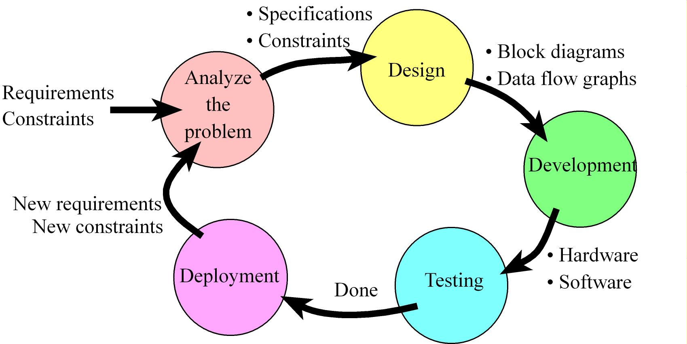
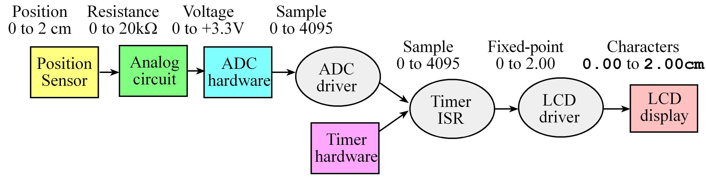
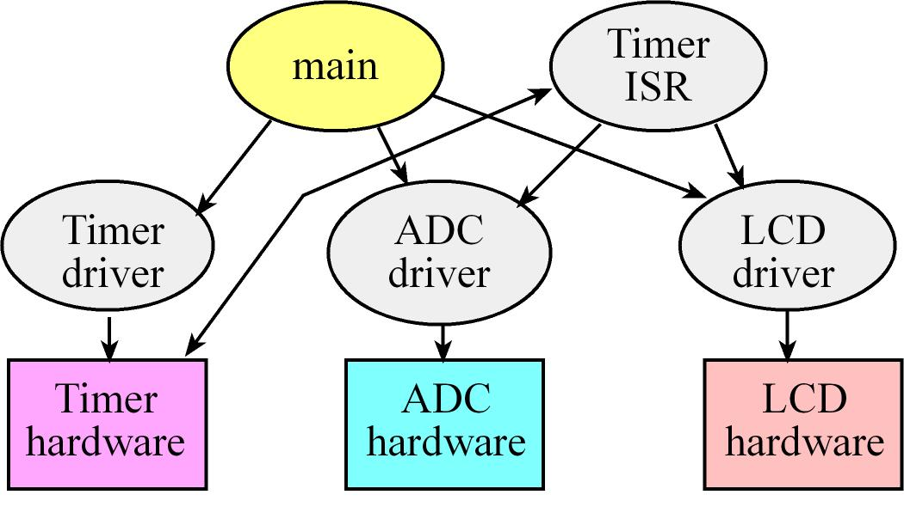
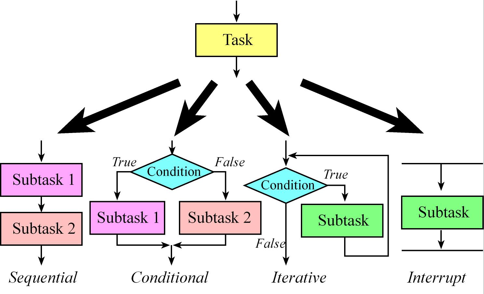

# Desing and Development processes

## Product life cycle
### Life cycle
The development of a product follows an analysis-design-implementation-testing-deployment cycle.

During the **analysis phase**, we discover the requirements and constraints for our proposed system.
* A **requirement** is usually defined in general terms, it often refers to an objective of the system.
* **Specifications** are detailed parameters describing how the system should work, it entails detailed engineering rigor.
* A **constraint** is a limitation, within which the system must operate.

### Requirements Document
A requirements document states what the system will do. It does not state how the system will do it. The main purpose of a requirements document is to serve as an agreement between you and your clients describing what the system will do.
Write the document so that it is easy to read and understand by others.  IEEE publishes a number of templates that can be used to define a project (IEEE STD 830-1998). 

Possible outline:
1. **Overview**
  1.1. **Objectives**: Why are we doing this project? What is the purpose?
  1.2. **Process**: How will the project be developed?
  1.3. **Roles and Responsibilities**: Who will do what?  Who are the clients?
  1.4. **Interactions with Existing Systems**: How will it fit in?
  1.5. **Terminology**: Define terms used in the document.
  1.6. **Security**: How will intellectual property be managed?

2. **Function Description**
  2.1. **Functionality**: What will the system do precisely?
  2.2. **Scope**: List the phases and what will be delivered in each phase.
  2.3. **Prototypes**: How will intermediate progress be demonstrated?
  2.4. **Performance**: Define the measures and describe how they will be determined.
  2.5. **Usability**: Describe the interfaces. Be quantitative if possible.
  2.6. **Safety**: Explain any safety requirements and how they will be measured.

3. **Deliverables**
  3.1. **Reports**: How will the system be described?
  3.2. **Audits**: How will the clients evaluate progress?
  3.3. **Outcomes**: What are the deliverables? How do we know when it is done?

**Observation**: To build a system without a requirements document means you are never wrong, but never done.

### Data Flow graph
**Design phase**: we build a conceptual model of the hardware/software system. It is in this model that we exploit as much abstraction as appropriate. The project is broken into modules or subcomponents.
During this phase, we estimate the cost, schedule, and expected performance of the system. At this point we can decide if the project has a high enough potential for profit. 

**Data flow graph**: this is a block diagram of the system, showing the flow of information. Arrows point from source to destination. The rectangles represent hardware components, and the ovals are software modules. 
We use data flow graphs in the high-level design, because they describe the overall operation of the system while hiding the details of how it works.

### Call graph
Call graphs are a graphical way to define how the software/hardware modules interconnect.
**Data structures**, which will be presented throughout the class, include both the organization of information and mechanisms to access the data. Rectangles represent hardware components, and ovals show software modules.

An arrow points from the calling routine to the module it calls. The I/O ports are organized into groups and placed at the bottom of the graph. A high-level call graph, shows only the high-level hardware/software modules. 
A detailed call graph would include each software function and I/O port. Normally, hardware is passive and the software initiates hardware/software communication.

### Implementation
An advantage of a top-down design is that implementation of subcomponents can occur simultaneously. During the initial iterations of the life cycle, it is quite efficient to implement the hardware/software using simulation. 
One major advantage of simulation is that it is usually quicker to implement an initial product on a simulator versus constructing a physical device out of actual components.

Rapid prototyping is important in the early stages of product development. This allows for more loops around the analysis-design-implementation-testing-deployment cycle, which in turn leads to a more sophisticated product.

During the **testing** phase, we evaluate the performance of our system. First, we debug the system and validate basic functions. Next, we use careful measurements to optimize performance such as static efficiency (memory requirements), dynamic efficiency (execution speed), accuracy (difference between expected truth and measured), and stability (consistent operation.)

**Maintenance** is the process of correcting mistakes, adding new features, optimizing for execution speed or program size, porting to new computers or operating systems, and reconfiguring the system to solve a similar problem. No system is static. Customers may change or add requirements or constraints. 
To be profitable, we probably will wish to tailor each system to the individual needs of each customer. Maintenance is not really a separate phase, but rather involves additional loops around the life cycle.

With a **bottom-up** design we begin with solutions and build up to a problem statement. In a bottom-up design, one begins with designing, building, and testing low-level components. The low-level designs can be developed in parallel. Bottom-up design may be inefficient because some subsystems may be designed, built, and tested, but never used.
The bottom-up design process allows creative ideas to drive the products a company develops. It also allows one to quickly test the feasibility of an idea.

If one fully understands a problem area and the scope of potential solutions, then a **top-down** design will arrive at an effective solution most quickly. On the other hand, if one doesn’t really understand the problem or the scope of its solutions, a bottom-up approach allows one to start off by learning about the problem.

A **top-down designer** starts with a problem, conceives of a solution, procures the parts, builds a prototype, and then tests to see if it works.

A **bottom-up designer** first procures the parts, tries to put the pieces together in interesting ways, and then sees if it solves any interesting problems.

## Successive Refinement
### Structured programming
We begin with a set of general specifications, and then create a list of requirements and constraints. The general specifications describe the problem statement in an overview, requirements define the specific things the system must do, and constraints are the specific things the system must not do. These requirements and constraints will guide us as we develop and test our system.

**Observation**: Sometimes the specifications are ambiguous, conflicting, or incomplete.

There are two approaches to those situations:
* Resolve the issue with your supervisor or customer. 
* Make a decision and document the decision.

**Successive refinement**, **stepwise refinement**, and **systematic decomposition** are three equivalent terms for a technique to convert a problem statement into a software algorithm.
1. Start with a task and decompose the task into a set of simpler subtasks.
2. The subtasks are decomposed into even simpler sub-subtasks. We make progress as long as each subtask is simpler than the task itself.
3. During the task decomposition we must make design decisions as the details of exactly how the task will be performed are put into place.
4. A subtask is so simple that it can be converted to software code.

The **sequence**, **conditional**, and **iteration** are the three building blocks of structured programming. Because embedded systems often have real-time requirements, they employ a fourth building block called **interrupts**. We will implement time-critical tasks using interrupts, which are hardware-triggered software functions.

When solving problems on the computer, we need to solve these questions:

* **What does being in a state mean?**
List the parameters of the state

* **What is the starting state of the system?**
Define the initial state

* **What information do we need to collect?**
List the input data

* **What information do we need to generate?**
List the output data

* **How do we move from one state to another?**
Specify actions we could perform

* **What is the desired ending state?**
Define the ultimate goal

### How to write software?
The **state** of a system specifies "what do we know?" or "what do we believe to be true?" It is extremely important to encode state in a clear and unambiguous manner.

**Global variables**: An obvious way for software to remember information is to place the data in a permanent variable. If the data is shared across the system we call it a global variable.

**Input devices**: This works when software only needs to know the current state, and it doesn't matter about previous conditions.

**Output devices**: Fundamentally, output devices behave in a manner similar to global variables. Outputs are permanently allocated and can be shared across the system.

**Execution location**: A very typical technique to encode knowledge is to making a mapping between where the software is executing and what you believe to be true.
The limitation with this method of encoding state is that it, like inputs, only defines the current knowledge and has no permanent memory of previous states.

## Quality Design
### The golden rule
The ultimate goal of the system is to satisfy the stated objectives such as accuracy, stability, and input/output relationships. Nevertheless it is appropriate to separately evaluate the individual components of the system.

Quantitative criteria include dynamic efficiency (speed of execution), static efficiency (memory requirements), and accuracy of the results. Qualitative criteria center on ease of software maintenance. 

Another qualitative way to evaluate software is ease of understanding. If your software is easy to understand then it will be:

* Easy to debug (fix mistakes)
* Easy to verify (prove correctness)
* Easy to maintain (add features)

**Common Error**: Programmers who sacrifice clarity in favor of execution speed often develop software that runs fast, but is error-prone and difficult to change.

In order to evaluate our software quality, we need performance measures.
**Dynamic efficiency** is a measure of how fast the program executes. It is measured in seconds or processor bus cycles.

**Static efficiency** is the number of memory bytes required. Since most embedded computer systems have both RAM and ROM, we specify memory requirement in global variables, stack space, fixed constants and program. The global variables plus the stack must fit into the available RAM.

Qualitative performance measurements include those parameters to which we cannot assign a direct numerical value.