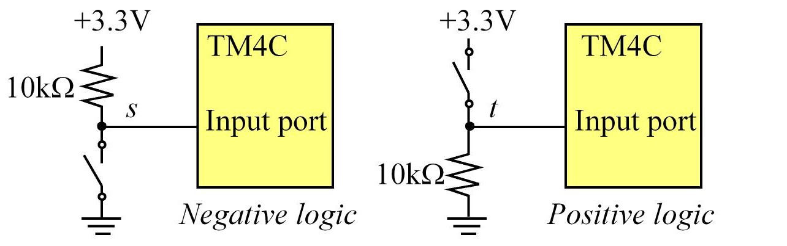

# Switches and LEDs

## Switch Interfaces
### Switches
Allows the human to input binary information into the computer. Typically we define the asserted state, or logic true, when the switch is pressed.
The switches are shown as little open circles. The connections have a resistance very close to 0Ω when the switch is pressed and have an almost infinite resistance when the switch is not pressed.

To convert the infinite/zero resistance into a digital signal, we can use a pull-down resistor to ground or a pull-up resistor to +3.3V.

**Positive logic** - With a pull-down resistor, the digital signal will be **low** if the switch is **not pressed** and **high** if the switch is **pressed**. 
The asserted state is a **logic high**.

**Negative logic** - With a pull-up resistor, the digital signal will be **high** if the switch is **not pressed** and **low** if the switch is **pressed**.
The asserted state is a **logic low**.

### Interfacing a Switch
**Driver** - Includes initialization, which is called once
**Abstraction** - Software that separates what the device does (Init, On, Off)

## LED interfaces
### Interfacing LEDs
The anode is labelled **a** or **+**, and cathode is labelled **k** or **-**. The cathode is the short lead and there may be a slight flat spot on the body of round LEDs. Thus, the anode is the longer lead. 
The brightness of an LED depends on the applied electrical power (**P=I*V**).

### Interfacing a low-current LEDs
A **system** is created by connecting components.

**R = VOH - Vd / Id**

## Design example
### Requirements Document
The main purpose of a requirements document is to serve as an agreement between you and your clients describing what the system will do. Write the document so that it is easy to read and understand by others. It should be unambiguous, complete, verifiable, and modifiable.

The requirements document should not include how the system will be designed. This allows the engineer to make choices during the design to minimize cost and maximize performance. Rather it should describe the problem being solved and what the system actually does.
It can include some constraints placed on the development process. Ideally, it is co-written by both the engineers and the non-technical clients.

**Requirements document** example:
1. Overview
1.1 Objectives
1.2 Process
1.3 Roles and responsabilities
1.4 Interactions with Existing Systems
1.5 Terminology
1.6 Security
2. Function Description
2.1 Functionality
2.2 Scope
2.3 Prototypes
2.4 Performance
2.5 Usability
2.6 Safety
3. Deliverables
3.1 Reports
3.2 Audits
3.3 Outcomes

